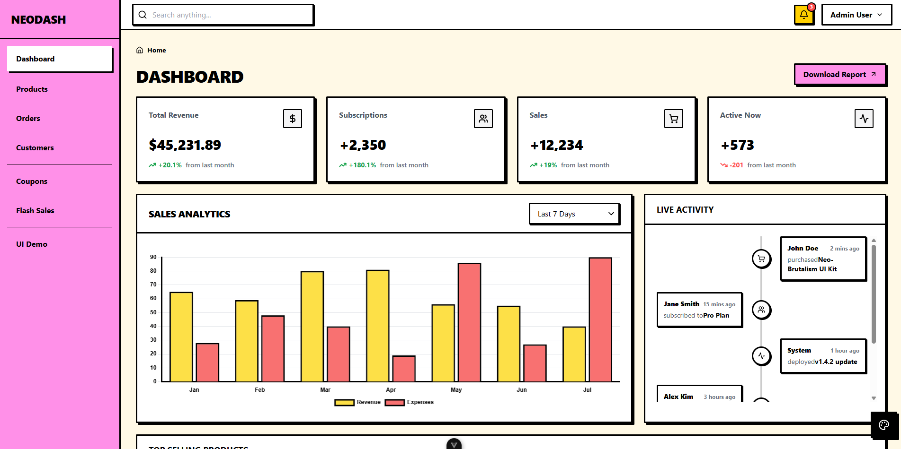

<div align="center">

# Neo-Brutalism Vue Dashboard Template

A striking, highly-opinionated dashboard template built for modern web applications. Designed following the **Neo-Brutalism** aesthetic: characterized by bold typography, high-contrast colors, harsh 3px black borders, and hard-edged drop shadows.

<br />

<p align="center">
  
  
  
  
</p>

<br />



</div>

## Features

- **Neo-Brutalism UI Components**: Fully custom, accessible, and uniquely styled components (Buttons, Inputs, Cards, Tables, Tabs, Steppers, Badges, Modals, etc.).
- **Vite & Vue 3 (Composition API)**: Blazing fast development server and modern Vue patterns.
- **Tailwind CSS**: Strict, predefined styling following brutalist principles (via `index.css`).
- **Responsive Layout**: Works flawlessly on mobile, tablet, and desktop with a mobile-drawer sidebar.
- **Full Application Flow**: Includes pages for Dashboard, Products, Orders, Customers, and Marketing (Coupons & Flash Sales).
- **Interactive States**: Animated loading spinners, empty states, and built-in form validation feedback.

## Quick Start

### Prerequisites

Make sure you have [Node.js](https://nodejs.org/) (v16+ recommended) installed.

### Installation

1. Clone the repository and navigate into the directory:

   ```bash
   cd neobrutalism-dashboard-template
   ```

2. Install dependencies:

   ```bash
   npm install
   ```

3. Start the development server:

   ```bash
   npm run dev
   ```

4. Open your browser and visit `http://localhost:5173/`.

### Building for Production

To create an optimized production build:

```bash
npm run build
```

This will compile the application into the `dist/` folder, ready to be deployed to Vercel, Netlify, or any static hosting service.

## Folder Structure

```
.
├── src/
│   ├── assets/       # Static assets (images, fonts, global CSS like index.css)
│   ├── components/   # Reusable Vue components
│   │   ├── layout/   # Layout elements (Sidebar, Topbar, PageHeader)
│   │   └── ui/       # Neo-Brutalism UI elements (Button, Card, Input, Table, etc.)
│   ├── data/         # Mock data files for development (index.ts)
│   ├── router/       # Vue Router configuration (lazy-loaded routes)
│   ├── views/        # Page-level components (Dashboard, Products, Orders, etc.)
│   ├── App.vue       # Root component
│   └── main.ts       # Application entry point
├── public/           # Public static files
├── index.html        # HTML template
├── tailwind.config.js# Tailwind configuration (colors, fonts, box-shadows)
└── package.json      # Dependencies and scripts
```

## How to Customize

### Modifying Colors

The template relies on CSS custom properties (variables) defined in `src/assets/index.css` and mapped in `tailwind.config.js`.

To change the primary color (default is yellow):

1. Open `src/assets/index.css`.
2. Locate the `:root` pseudo-class.
3. Change the `--color-primary` value (e.g., to a neon green: `#39ff14`).

```css
:root {
  --color-primary: #39ff14; /* Your new color */
  --color-secondary: #c084fc;
  --color-background: #fdfbf7;
  /* ... */
}
```

### Modifying the Brutalist Shadows & Borders

Neo-Brutalism heavily relies on thick borders and solid drop-shadows. These are defined globally:

- **Borders**: Most components use Tailwind's `border-3 border-black`. You can change the border width via `tailwind.config.js` or directly in component templates.
- **Shadows**: Custom shadows (`shadow-neo`, `shadow-neo-sm`) are defined in `tailwind.config.js`. You can tweak the X/Y offsets (currently `4px 4px 0px 0px rgba(0,0,0,1)`).

### Adding New Routes

1. Create a new view component in `src/views/` (e.g., `SettingsView.vue`).
2. Register it in `src/router/index.ts` using dynamic imports (lazy loading):
   ```typescript
   {
     path: '/settings',
     name: 'settings',
     component: () => import('../views/SettingsView.vue'),
   }
   ```
3. Add a link to the `src/components/layout/Sidebar.vue` component.

## License

This project is open-source and available under the [MIT License](LICENSE).
